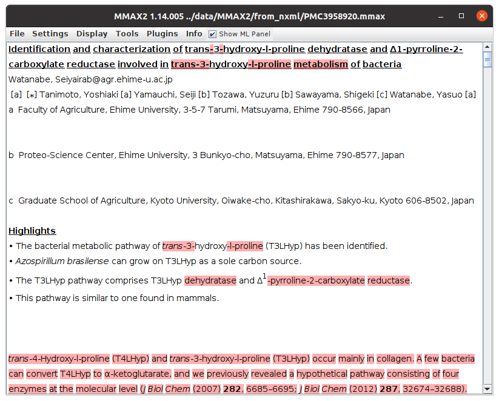

# BioNLP2021

This is the code repository for the paper [Word-Level Alignment of Paper Documents with their Electronic Full-Text Counterparts](https://www.aclweb.org/anthology/2021.bionlp-1.19.pdf)

The repository contains code for converting both *.nxml* and *.pdf* files to MMAX2 format, and for creating an alignment between both representations.

For copyright reasons, we cannot provide the scanned .pdf documents from our collection, nor all of the corresponding .pdf or .nxml files from PubMed Central.
Instead, the ./data folder contains the open-access paper 

Seiya Watanabe, Yoshiaki Tanimoto, Seiji Yamauchi, Yuzuru Tozawa, Shigeki Sawayama, and Yasuo Watanabea (2014): [Identification and characterization of trans-3-hydroxy-l-proline dehydratase and Δ1-pyrroline-2-carboxylate reductase involved in trans-3-hydroxy-l-proline metabolism of bacteria](https://www.ncbi.nlm.nih.gov/pmc/articles/PMC3958920) FEBS Open Bio. 2014; 4: 240–250.

in .pdf and .nxml format for demonstration. 
Note, however, that both conversion tools (`pmc2mmax` and `pdf2mmax`) can be run in batch mode for converting entire folders of input documents at once.

For questions, you can contact [Mark-Christoph Müller](mailto:mark-christoph.mueller@h-its.org?subject=bionlp2021)

*Setup*

The alignment code uses the MMAX2 data format internally, so installing pyMMAX2 is **required**. 
Installing the Java-based MMAX2 annotation tool is only required for viewing the converted data, and is strongly recommended.

```console
conda create -n bionlp2021 python=3.7
source activate bionlp2021
git clone https://github.com/nlpAThits/BioNLP2021
cd BioNLP2021
pip install -r requirements.txt
git clone https://github.com/nlpAThits/pyMMAX2
pip install pyMMAX2/.
git clone https://github.com/nlpAThits/MMAX2
```

*Convert sample PMC-NXML to MMAX2 Format*
```console
(bionlp2021) foo@bar:~$  python ./code/pmc2mmax.py --pmc_path ./data/nxml/PMC3958920.nxml --mmax2_base_path ./data/MMAX2/from_nxml/
```

*Console output*
```console
Level file name set to PMC3958920_structure_markables.xml
Markables at ./data/MMAX2/from_nxml/./Markables/PMC3958920_structure_markables.xml not found, skipping!
Level file name set to PMC3958920_alignments_markables.xml
Markables at ./data/MMAX2/from_nxml/./Markables/PMC3958920_alignments_markables.xml not found, skipping!

MMAX2 Project Info:
-------------------
.mmax file        : ./data/MMAX2/from_nxml/PMC3958920.mmax
Basedata elements : 8532
Markable levels   :
 structure        :   506 markables [DEFAULT: none defined]
 alignments       :     0 markables [DEFAULT: none defined]
```

*Open file in MMAX2 annotation tool*

(This is optional.)
```console
(bionlp2021) foo@bar:~$ cd MMAX2
(bionlp2021) foo@bar:~$ ./mmax2_flex.sh ../data/MMAX2/from_nxml/PMC3958920.mmax
```


*Convert sample PDF to MMAX2 Format (via PNG)*

Text recognition is done with tesseract (v 4) (via pytesseract). Use the **required** --tessdata_dir parameter to point tesseract to the language model to use.
The following command expects the tessdata model at the provided path (you might have to adapt that to your system).

Alternative tesseract models can be downloaded here: [tessdata_best](https://github.com/tesseract-ocr/tessdata_best). Download the folders to your system and point tesseract to them using the --tessdata_dir parameter. When trying different tesserat models, make sure to keep the --force_new_mmax2 option such that new OCR results will actually be created.

```console
(bionlp2021) foo@bar:~$ python ./code/pdf2mmax.py --pdf_path ./data/pdf/real-pdf/PMC3958920.pdf  --mmax2_base_path ./data/MMAX2/from_png/converted/ --force_new_mmax2 --png_base_path ./data/temp_png/ --force_new_png --dpi 300 --tessdata_dir /usr/share/tesseract-ocr/4.00/tessdata
```

*console output*
```console
Level file name set to PMC3958920_ocr_words_level.xml
Markables at ./data/MMAX2/from_png/converted/Markables/PMC3958920_ocr_words_level.xml not found, skipping!
Level file name set to PMC3958920_ocr_lines_level.xml
Markables at ./data/MMAX2/from_png/converted/Markables/PMC3958920_ocr_lines_level.xml not found, skipping!
Level file name set to PMC3958920_alignments_markables.xml
Markables at ./data/MMAX2/from_png/converted/Markables/PMC3958920_alignments_markables.xml not found, skipping!
	Converting ./data/pdf/real-pdf/PMC3958920.pdf to 300 dpi PNG file ...
	File ./data/temp_png//PMC3958920.pdf@300DPI-page-01.png
		OCR ...
		BS4 ...
		hOCR2MMAX2 ...
	File ./data/temp_png//PMC3958920.pdf@300DPI-page-02.png
		OCR ...
		BS4 ...
		hOCR2MMAX2 ...
	File ./data/temp_png//PMC3958920.pdf@300DPI-page-03.png
		OCR ...
		BS4 ...
		hOCR2MMAX2 ...
	File ./data/temp_png//PMC3958920.pdf@300DPI-page-04.png
		OCR ...
		BS4 ...
		hOCR2MMAX2 ...
	File ./data/temp_png//PMC3958920.pdf@300DPI-page-05.png
		OCR ...
		BS4 ...
		hOCR2MMAX2 ...
	File ./data/temp_png//PMC3958920.pdf@300DPI-page-06.png
		OCR ...
		BS4 ...
		hOCR2MMAX2 ...
	File ./data/temp_png//PMC3958920.pdf@300DPI-page-07.png
		OCR ...
		BS4 ...
		hOCR2MMAX2 ...
	File ./data/temp_png//PMC3958920.pdf@300DPI-page-08.png
		OCR ...
		BS4 ...
		hOCR2MMAX2 ...
	File ./data/temp_png//PMC3958920.pdf@300DPI-page-09.png
		OCR ...
		BS4 ...
		hOCR2MMAX2 ...
	File ./data/temp_png//PMC3958920.pdf@300DPI-page-10.png
		OCR ...
		BS4 ...
		hOCR2MMAX2 ...
	File ./data/temp_png//PMC3958920.pdf@300DPI-page-11.png
		OCR ...
		BS4 ...
		hOCR2MMAX2 ...
```

*Open file in MMAX2 annotation tool*
(Optional)

```console
(bionlp2021) foo@bar:~$ cd MMAX2
(bionlp2021) foo@bar:~$ ./mmax2_flex.sh ../data/MMAX2/from_png/converted/PMC3958920.mmax
```


*Create a word-level alignment of the two documents*

The following creates an alignment with *all* pre- and post-processing options (best) between the .nxml and the PNG-converted .pdf (conv) file. The alignment is identified by the label *best_conv*. 

```console
(bionlp2021) foo@bar:~$ python ./code/align.py --ocr_mmax2_path ./data/MMAX2/from_png/converted/ --xml_mmax2_path ./data/MMAX2/from_nxml/ --alignment_label best_conv --de_hyphenate --pre_conflate --pre_split --post_forcealign
```

*Console output*
```console
Level file name set to PMC3958920_ocr_words_level.xml
Level file name set to PMC3958920_ocr_lines_level.xml
Level file name set to PMC3958920_alignments_markables.xml
Markables at ./data/MMAX2/from_png/converted/Markables/PMC3958920_alignments_markables.xml not found, skipping!
Retrieving alignment markables with label 'best_conv' ...
Level file name set to PMC3958920_structure_markables.xml
Level file name set to PMC3958920_alignments_markables.xml
Markables at ./data/MMAX2/from_nxml/./Markables/PMC3958920_alignments_markables.xml not found, skipping!
Retrieving alignment markables with label 'best_conv' ...
Compressing, #words in A: 13617, #words in B: 8532
De-hyphenating...
Conflating...
Splitting...
48 pre-splits, recursing...
Splitting...
Force-aligning...
```

|  |  | 
| -------------------------------------------------------------------- | -------------------------------------------------------------------- |
